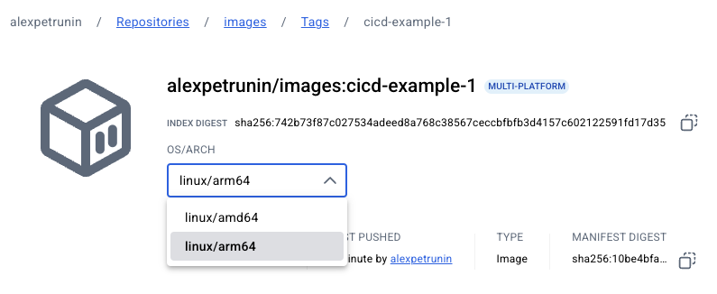

# cicd-example-1
Test repo for a simple CI/CD pipeline with GitHub Actions


## Workflow
Triggers on push and pull request to the main branch.
The workflow consists of two jobs: build and docker. All ```.md``` files and ```docs/``` directory are ignored in the workflow.


## Build job
The build job sets up the Go environment, downloads dependencies, builds the project, and runs tests.

## Docker job
The docker job logs into Docker Hub, sets up QEMU and Docker Buildx, and builds and pushes the artefacts to Docker Hub public registry.


This job generates images for multiple architectures: amd64 and arm64 under ```cicd-example-1``` tag.

